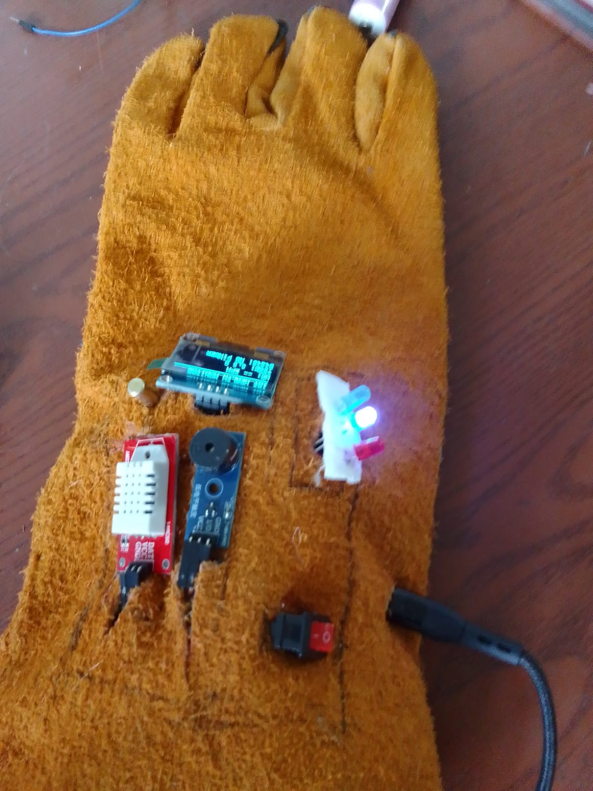

# 🏥 IoT Smart Health & Environmental Monitor (ESP32)
### Autonomous Biometric & Environmental Telemetry Engine

An advanced, wearable IoT health and environmental safety monitor built on the **ESP32** architecture. The system establishes a multi-sensor array to continuously sample real-time physiological metrics (heart rate, blood oxygen levels, fall/tilt detection) alongside ambient micro-climate data (temperature, humidity). It securely streams clean telemetry packets to a cloud infrastructure for instantaneous monitoring.

Developed by **Nethmi Samadhi** | NIBM School of Computing & Engineering

---

  
   
  <em>Prototype Assembly: ESP32 NodeMCU, MAX30105 Biometric Sensor, DHT22/DS18B20 Environmental Probes, and Integrated Tilt/Accelerometer on a functional wearable harness.</em>

---

## 🚀 Core Functionalities

* **Biometric Synchronization:** Active photoplethysmogram (PPG) sensing for heartbeat intervals, finger-detection thresholds, and continuous oxygen (SpO2) metrics.
* **Incident Analysis:** Advanced acceleration and tilt-logic integration to instantly identify sudden physical impacts or falls, triggering immediate telemetry alerts.
* **Micro-Climate Profiling:** High-accuracy logging of thermal and humidity variances to calculate heat index and verify environmental safety.
* **Seamless Cloud Datastream:** Encrypted background Wi-Fi communication pipeline streaming live data packets directly into a **Firebase Realtime Database** configuration.
* **On-Device Graphical UI:** Low-latency localized readout rendering diagnostic data, sensor status, and immediate alerts on an integrated SSD1306 OLED display.

---

## 🛠️ Hardware & Sensor Architecture

The firmware layer establishes non-blocking execution cycles to pool multidimensional data from specialized sensor modules via optimized communication buses.
